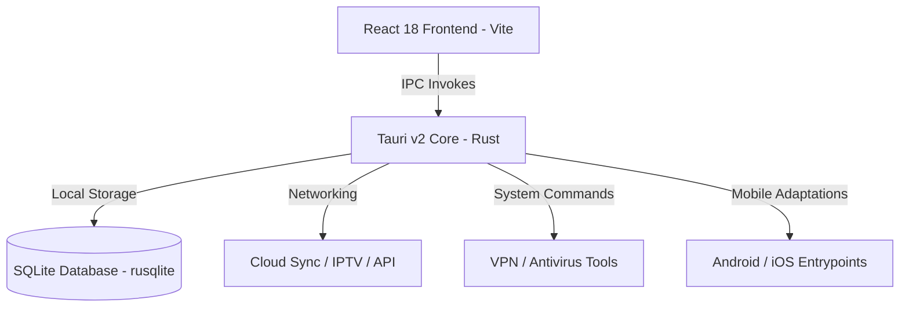

# 🎬 CinaVault Premium — Multi-Platform Media Server

[](https://github.com/johngraven75/CinaVault-Premium)
[](#platform-release-branches)
[](https://tauri.app)
[](#)

CinaVault Premium (Fusion Edition) is a state-of-the-art, high-performance media server and desktop application built with a modern React frontend and a robust Rust/SQLite backend, packaged securely via **Tauri v2**. 

Designed with a rich, responsive glassmorphism UI, CinaVault Premium brings server management, built-in security utilities (VPN & antivirus), IPTV streaming, AI metadata diagnostics, and cross-platform cloud sync together into a single cohesive dashboard.

---

## 🌐 Platform Release Branches

To maintain a clean and professional repository layout, the codebases and compiled installers for each supported operating system are organized into dedicated release branches. Use the links below to navigate to the source code and download the respective builds:

| Platform | Branch Name | Build Version | Primary Deliverable |
| :--- | :--- | :--- | :--- |
| **🖥️ Windows** | [`release/windows`](https://github.com/johngraven75/CinaVault-Premium/tree/release/windows) | Build 130 (Desktop) | `.exe` Setup Installer / `.msi` Package |
| **🤖 Android** | [`release/android`](https://github.com/johngraven75/CinaVault-Premium/tree/release/android) | Build 130 (Mobile) | `.apk` Universal Release Build |
| **📱 iOS** | [`release/ios`](https://github.com/johngraven75/CinaVault-Premium/tree/release/ios) | Build 130 (App Store) | App Store Deployment Source & Zip |

---

## ⚡ Core Feature Highlights

### 🎨 Glassmorphism & High-Performance UI
* Beautiful dark mode paneling using **Vite + React 18** and **TailwindCSS**.
* Fluid, GPU-accelerated micro-animations powered by **Framer Motion**.
* Modern, high-legibility typography via Google Fonts (*Space Grotesk*, *Orbitron*, and *JetBrains Mono*).

### 🛡️ Integrated Security Suite
* **Built-in VPN Bridge**: Local WireGuard tunnel client configurations with status and disconnect controls (utilizing `wg-quick` on POSIX and automated service installs on Windows).
* **Antivirus Integration**: Direct command surface hooking into security scanners (e.g. Windows Defender AV engine on Windows) to verify the integrity of media libraries.

### 🧠 AI Diagnostics & Enrichment
* **Metadata Checker**: Local poster file validation, custom filename normalization, and AI-driven metadata extraction to auto-verify media listings.
* **Adult Site Providers**: Local integration with PhoenixAdult, StashDB, and ThePornDB for automated metadata matching and chapter/poster caching.

### 📺 IPTV & Channel Syncing
* Full synchronization with **Xtream Codes** profiles.
* Auto-hydrating electronic program guides (EPG) and integrated live stream player.

### ☁️ Cloud Storage Integration
* Seamless synchronization and OAuth flow support for **Google Drive**, **Microsoft OneDrive**, and **Dropbox**.
* Local TCP loopback listener (`127.0.0.1:19284`) to securely handle redirect tokens directly in-app.

---

## 🛠️ Architecture & Tech Stack



* **Frontend**: React 18, TypeScript, TailwindCSS, Framer Motion, Zustand
* **Backend**: Rust, Tauri v2, SQLite (`rusqlite` with bundled bindings)
* **Networking**: HTTP Client (`reqwest` with `rustls-tls` for OpenSSL cross-build compatibility)

---

## 🚀 Development Setup

### Prerequisites
* **Node.js** (v18+) and **npm**
* **Rust Toolchain** (via `rustup`)
* **Android/iOS SDKs** (if compiling mobile targets)

### Getting Started

1. Clone the repository and navigate to the root directory:
   ```bash
   git clone https://github.com/johngraven75/CinaVault-Premium.git
   cd CinaVault-Premium
   ```

2. Install frontend dependencies:
   ```bash
   npm install
   ```

3. Run the development server (runs Vite dev server and spawns Tauri desktop window):
   ```bash
   npm run dev
   ```

4. Build the production application bundle:
   * **Desktop (Windows)**:
     ```bash
     npm run build
     ```
   * **Android**:
     Ensure `ANDROID_HOME` and `NDK_HOME` are set, then run:
     ```bash
     npm exec tauri -- android build --apk
     ```
