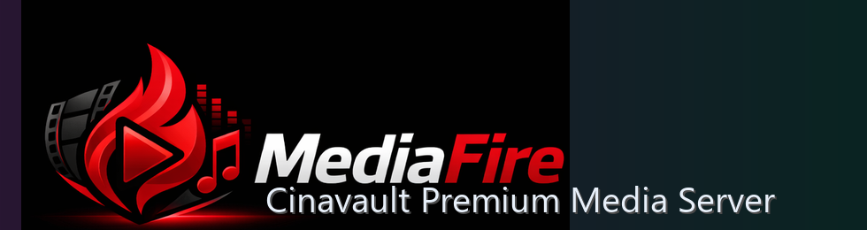
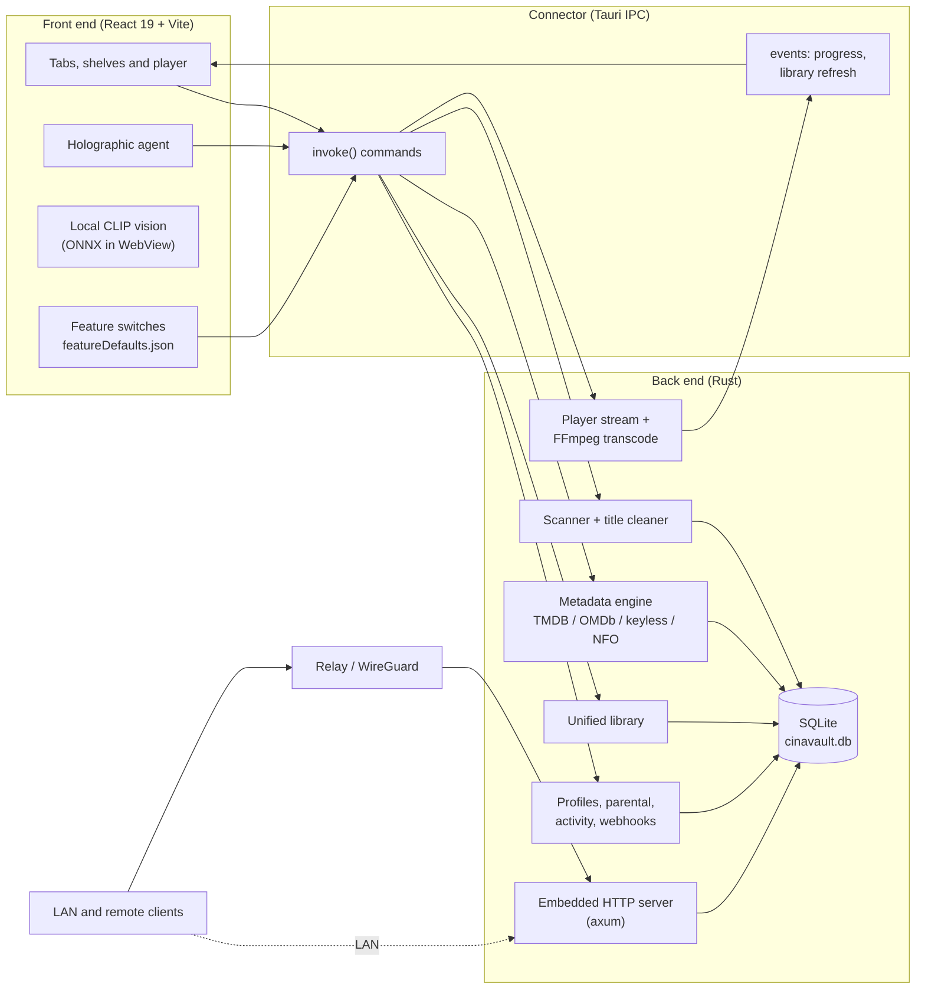
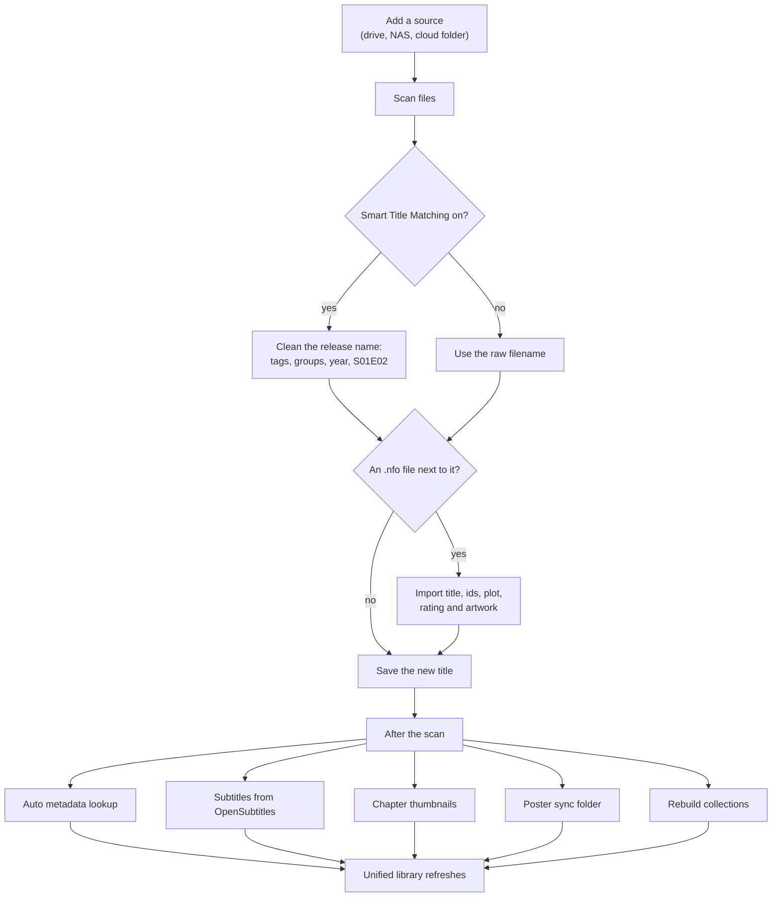
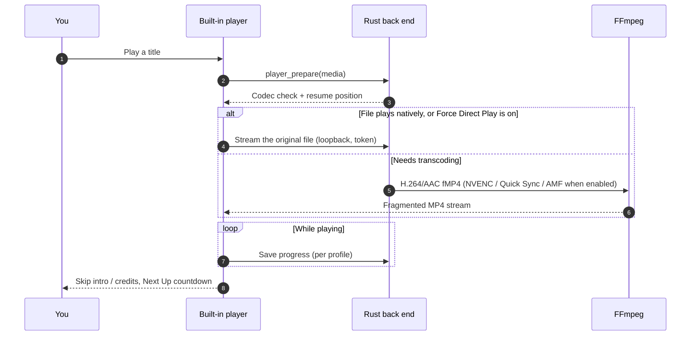
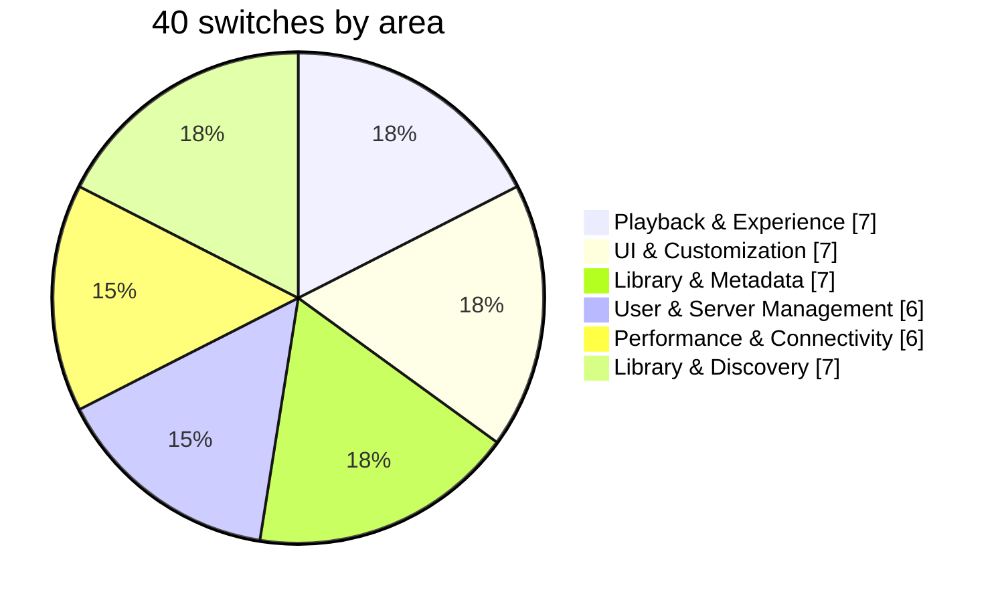
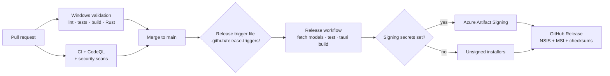

<p align="center">
  
</p>

<h1 align="center">CinaVault Premium</h1>

<p align="center">
  A Windows media center and personal media server: one library across every drive, NAS and cloud folder,
  a built-in player, offline AI identification and a holographic assistant.
</p>

<p align="center">
  <b>v1.0.2 Pre-Beta · Build 102</b> · Tauri 2 · Rust · React 19 · SQLite
</p>

---

## Contents

- [Highlights](#highlights)
- [Architecture](#architecture)
- [How a library scan flows](#how-a-library-scan-flows)
- [How playback flows](#how-playback-flows)
- [Feature switches](#feature-switches)
- [Getting started](#getting-started)
- [Testing](#testing)
- [Build and release pipeline](#build-and-release-pipeline)
- [Repository layout](#repository-layout)
- [Documentation](#documentation)

## Highlights

| Area | What you get |
|---|---|
| **Unified library** | Local drives, NAS shares and cloud folders are scanned into one library, and each work appears once, shown as its best copy. |
| **Metadata** | TMDB, OMDb and Fanart (with your keys); TVMaze, Cinemeta and others without keys; Kodi `.nfo` import and release-name cleanup. |
| **Offline AI** | A bundled CLIP vision model identifies films and checks posters with no account, key or network ([docs](docs/LOCAL_AI.md)). |
| **Holographic agent** | A 3D animated assistant that can search, play and manage the library. |
| **Built-in player** | Direct play when the file can be decoded, and on-the-fly H.264/AAC transcoding (with GPU encoders) when it can't. Resume, skip intro/credits, next up and gapless. |
| **Media server** | An embedded HTTP server for LAN and remote devices, with accounts, API keys, a bandwidth cap, a cache layer and an optional relay or WireGuard tunnel. |
| **Households** | Profiles with their own progress and watchlist, parental controls behind a PIN, an activity log and webhooks. |
| **Discovery** | Continue Watching, Watchlist, Trending, Recommendations, Similar Titles, Genre Radio and New Releases. |
| **More** | Live TV (IPTV), Google Cast, downloads, duplicate finder, and Jellyfin/Emby/Plex plugin bridges. |

## Architecture

The app is a Tauri 2 desktop shell. A React front end talks to a Rust back end through typed IPC commands, and the same back end serves other devices over HTTP.


```mermaid
flowchart LR
  subgraph FE["Front end (React 19 + Vite)"]
    UI["Tabs, shelves and player"]
    HOLO["Holographic agent"]
    VISION["Local CLIP vision<br/>(ONNX in WebView)"]
    FLAGS["Feature switches<br/>featureDefaults.json"]
  end

  subgraph IPC["Connector (Tauri IPC)"]
    CMDS["invoke() commands"]
    EVENTS["events: progress,<br/>library refresh"]
  end

  subgraph BE["Back end (Rust)"]
    SCAN["Scanner + title cleaner"]
    META["Metadata engine<br/>TMDB / OMDb / keyless / NFO"]
    LIB["Unified library"]
    PLAY["Player stream +<br/>FFmpeg transcode"]
    USERS["Profiles, parental,<br/>activity, webhooks"]
    SERVER["Embedded HTTP server<br/>(axum)"]
    DB[("SQLite<br/>cinavault.db")]
  end

  REMOTE["LAN and remote clients"]
  RELAY["Relay / WireGuard"]

  UI --> CMDS
  HOLO --> CMDS
  FLAGS --> CMDS
  CMDS --> SCAN & META & LIB & PLAY & USERS
  SCAN --> DB
  META --> DB
  LIB --> DB
  USERS --> DB
  PLAY --> EVENTS --> UI
  SERVER --> DB
  REMOTE --> RELAY --> SERVER
  REMOTE -. LAN .-> SERVER
```

Switch defaults live in one file, `src/features/featureDefaults.json`. The front end reads it directly, and the Rust back end compiles it in (`feature_flags.rs`), so both sides always agree.

## How a library scan flows


```mermaid
flowchart TD
  A["Add a source<br/>(drive, NAS, cloud folder)"] --> B["Scan files"]
  B --> C{"Smart Title Matching on?"}
  C -- yes --> D["Clean the release name:<br/>tags, groups, year, S01E02"]
  C -- no --> E["Use the raw filename"]
  D --> F{"An .nfo file next to it?"}
  E --> F
  F -- yes --> G["Import title, ids, plot,<br/>rating and artwork"]
  F -- no --> H["Save the new title"]
  G --> H
  H --> I["After the scan"]
  I --> J["Auto metadata lookup"]
  I --> K["Subtitles from OpenSubtitles"]
  I --> L["Chapter thumbnails"]
  I --> M["Poster sync folder"]
  I --> N["Rebuild collections"]
  J & K & L & M & N --> O["Unified library refreshes"]
```

Each step after the scan runs only while its switch is on, and each reports progress through the shared progress bar with a Stop button.

## How playback flows


```mermaid
sequenceDiagram
  autonumber
  participant U as You
  participant P as Built-in player
  participant R as Rust back end
  participant F as FFmpeg

  U->>P: Play a title
  P->>R: player_prepare(media)
  R-->>P: Codec check + resume position
  alt File plays natively, or Force Direct Play is on
    P->>R: Stream the original file (loopback, token)
  else Needs transcoding
    R->>F: H.264/AAC fMP4 (NVENC / Quick Sync / AMF when enabled)
    F-->>P: Fragmented MP4 stream
  end
  loop While playing
    P->>R: Save progress (per profile)
  end
  P-->>U: Skip intro / credits, Next Up countdown
```

## Feature switches

Every switch in **Settings > Advanced > Feature Matrix** changes real behavior; none is a placeholder. A test (`tests/featureMatrix.test.mjs`) fails the build if any switch is not read by working code.


```mermaid
pie showData title 40 switches by area
  "Playback & Experience" : 7
  "UI & Customization" : 7
  "Library & Metadata" : 7
  "User & Server Management" : 6
  "Performance & Connectivity" : 6
  "Library & Discovery" : 7
```

The full list, with what each switch does, is in [`src/features/featureCatalog.ts`](src/features/featureCatalog.ts).

## Getting started

**Requirements:** Windows 10/11, Node.js 22, the Rust stable toolchain, and the [Tauri 2 prerequisites](https://v2.tauri.app/start/prerequisites/) (WebView2, MSVC build tools).

```powershell
git clone https://github.com/johngraven75/CinaVault-Premium.git
cd CinaVault-Premium
npm ci
npm run fetch:ai-models      # bundles the offline vision model (about 149 MB)
npm run tauri:dev:windows    # run the app in development
npm run tauri:build:windows  # build the NSIS and MSI installers
```

Optional metadata keys (TMDB, OMDb, Fanart and others) are entered in the first-run wizard and stored in the Windows credential store, never in the repository.

## Testing

| Command | What it checks |
|---|---|
| `npm run lint` | TypeScript type check |
| `npm test` | Contract gates and every Node test suite (features, discovery, player, server and profiles, library, holographic UI, local vision, and others) |
| `cargo test --manifest-path src-tauri/Cargo.toml` | Rust unit and server integration tests |
| `npm run verify:contracts` · `npm run scan:preventive` | Shared front/back-end contracts and preventive risk scan |
| `npm run test:metadata-live` | Live TVMaze and Cinemeta poster acceptance (network) |

## Build and release pipeline


```mermaid
flowchart LR
  PR["Pull request"] --> V["Windows validation<br/>lint · tests · build · Rust"]
  PR --> CI["CI + CodeQL<br/>+ security scans"]
  V & CI --> M["Merge to main"]
  M --> T{"Release trigger file<br/>.github/release-triggers/"}
  T --> B["Release workflow<br/>fetch models · test · tauri build"]
  B --> S{"Signing secrets set?"}
  S -- yes --> SIGN["Azure Artifact Signing"]
  S -- no --> UNS["Unsigned installers"]
  SIGN & UNS --> GH["GitHub Release<br/>NSIS + MSI + checksums"]
```

Code signing is wired to Azure Artifact Signing and turns on as soon as the signing secrets are configured ([docs/CODE_SIGNING.md](docs/CODE_SIGNING.md)). Until then, installers are published unsigned, and Windows SmartScreen will warn on first run.

## Repository layout

```text
.
├── src/                    React front end
│   ├── components/         tabs, shelves, player, holographic agent, setup wizard
│   ├── features/           switch defaults, catalog and settings panels
│   ├── services/           IPC wrappers (playback, discovery, collections, vision…)
│   └── store/              zustand app state
├── src-tauri/              Rust back end and Tauri config
│   └── src/                scanner, metadata, server, player, profiles, parental…
├── tests/                  Node test suites (run with npm test)
├── scripts/                build, signing, model-fetch and verification scripts
├── contracts/              versioned front/back-end contract fixtures
├── plugins/                Jellyfin, Emby and Plex bridge manifests
├── public/                 branding (models are fetched, not committed)
├── docs/                   guides, ADRs, research and build history
└── .github/                workflows, release triggers, templates
```

## Documentation

| Guide | Topic |
|---|---|
| [docs/README.md](docs/README.md) | Index of all documentation |
| [docs/LIBRARY_ENGINE.md](docs/LIBRARY_ENGINE.md) | Unified library, duplicates and first-run setup |
| [docs/LOCAL_AI.md](docs/LOCAL_AI.md) | Offline vision model |
| [docs/CODE_SIGNING.md](docs/CODE_SIGNING.md) | Setting up Windows code signing |
| [docs/HLS_STREAM_SUPPORT.md](docs/HLS_STREAM_SUPPORT.md) | HLS and live streams |
| [docs/WIREGUARD_READINESS_AUTOCONNECT.md](docs/WIREGUARD_READINESS_AUTOCONNECT.md) | WireGuard remote access |
| [CHANGELOG.md](CHANGELOG.md) | What changed in each release |
| [SECURITY.md](SECURITY.md) | Reporting a vulnerability |
| [AGENTS.md](AGENTS.md) | Engineering rules for contributors |
